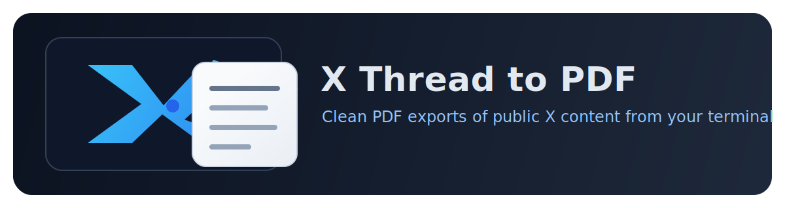
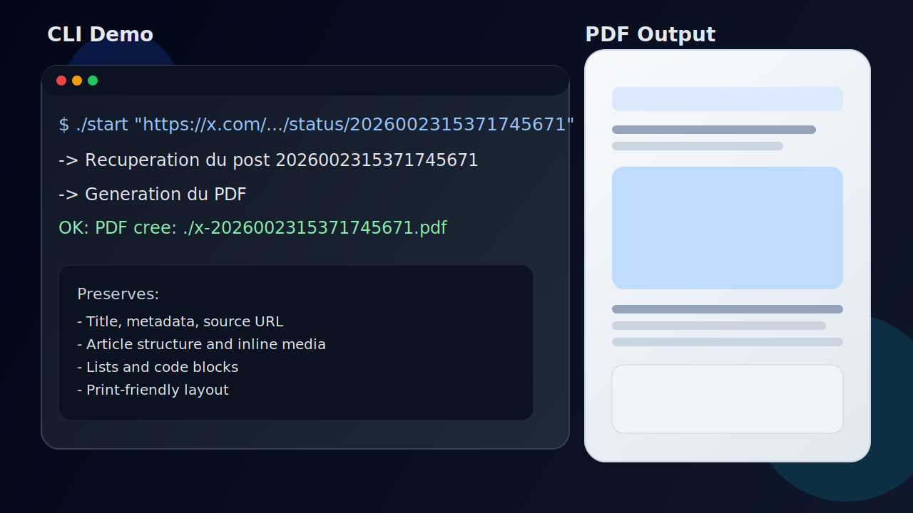
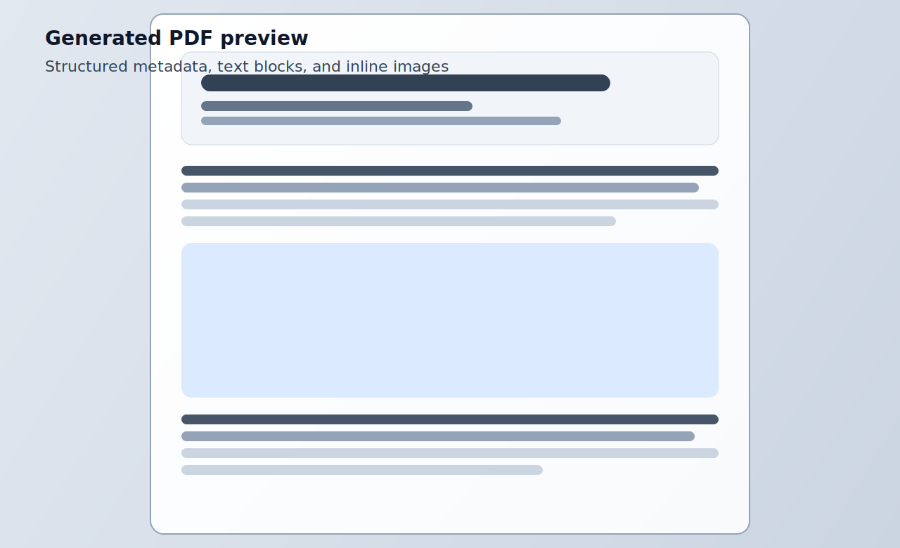

<p align="center">
  
</p>

<p align="center">
  Convert public X posts, threads, and long-form articles into clean PDFs from your terminal.
</p>

<p align="center">
  
  
  
  
</p>



## Why this project

`x-thread-to-pdf` is a focused CLI for creators, researchers, and readers who want a portable PDF copy of public X content while keeping structure and media close to the original flow.

It preserves:

- title and metadata
- author and source link
- text blocks and headings
- inline images in article flow
- lists and code blocks (when available from source payloads)



## Table of contents

- [Quick start](#quick-start)
- [Usage examples](#usage-examples)
- [How it works](#how-it-works)
- [Documentation](#documentation)
- [Contributing](#contributing)
- [Security and privacy](#security-and-privacy)
- [License](#license)

## Quick start

### 1. Clone

```bash
git clone <YOUR-REPO-URL>
cd articleX
```

### 2. Run with auto-bootstrap

The `./start` script initializes dependencies if needed and launches conversion:

```bash
./start "https://x.com/TheVixhal/status/2026002315371745671"
```

Default output:

```bash
./x-2026002315371745671.pdf
```

## Usage examples

### Example A: default output name

```bash
./start "https://x.com/TheVixhal/status/2026002315371745671"
```

### Example B: custom output path

```bash
./start "https://x.com/wickedguro/status/2025967492359913862" "./out/wickedguro.pdf"
```

### Example C: run CLI directly

```bash
npm install
npx playwright install chromium
node ./src/x-thread-to-pdf.mjs "https://x.com/TheVixhal/status/2026002315371745671" "./out/result.pdf"
```

## How it works

1. Parse the `status/<id>` from a public X URL.
2. Fetch normalized payloads from mirror APIs with retries and fallback.
3. Build a print-friendly HTML document with preserved content structure.
4. Render to PDF using Playwright Chromium.

## Documentation

Extended docs live in [`docs/`](docs/README.md):

- [Installation guide](docs/INSTALLATION.md)
- [Usage reference](docs/USAGE.md)
- [Architecture](docs/ARCHITECTURE.md)
- [Troubleshooting](docs/TROUBLESHOOTING.md)

## Contributing

Contributions are welcome. Open an issue for bugs or ideas, then submit a PR.

See [CONTRIBUTING.md](CONTRIBUTING.md) for the complete workflow.

## Security and privacy

- Do not commit secrets, tokens, or private datasets.
- This repository ignores `.env` and `.env.*` by default.
- Converted PDFs can contain sensitive content from source posts; review before sharing.

For full reporting guidance, see [SECURITY.md](SECURITY.md).

## Application icon

The app icon is available at:

- [`docs/assets/app-icon.svg`](docs/assets/app-icon.svg)

## License

MIT License. See [LICENSE](LICENSE).
